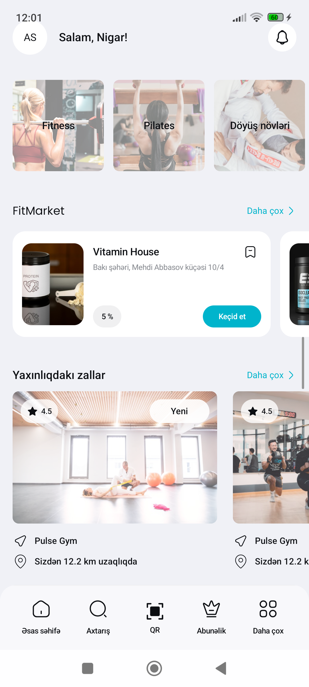
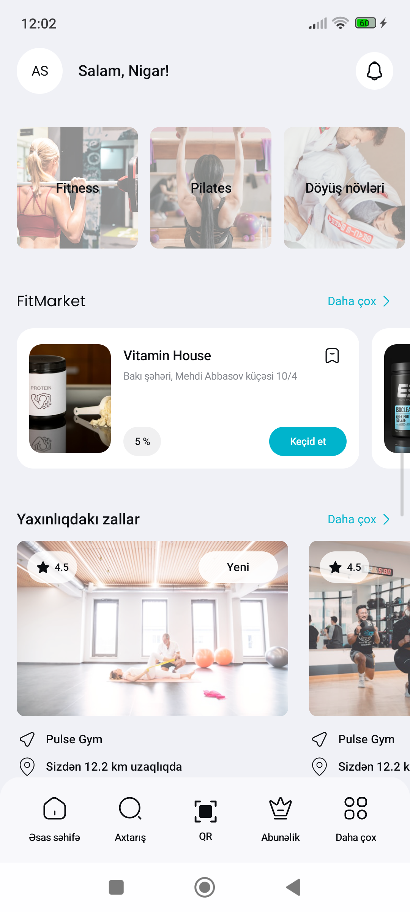
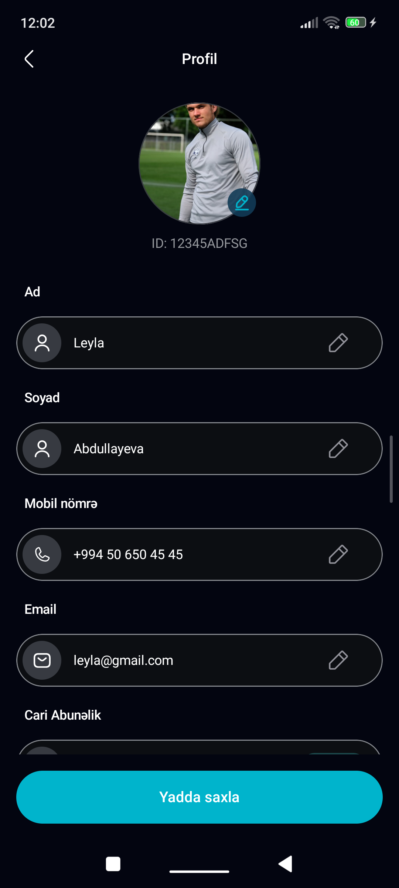
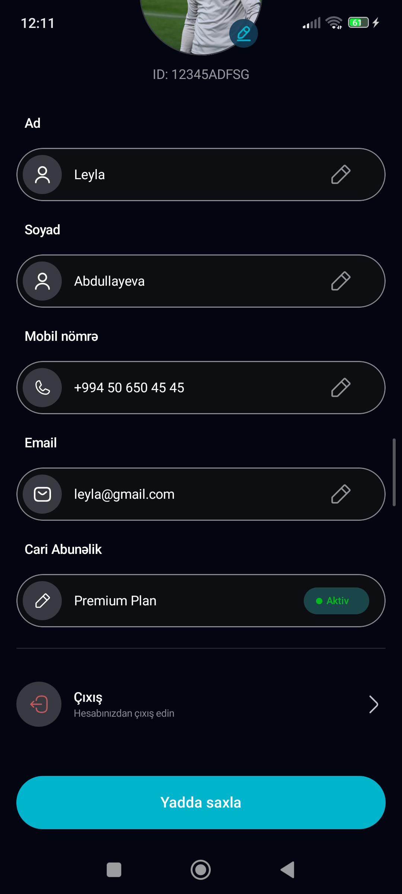

# FitNest Android

FitNest is an Android application implemented from the provided Figma design.
The project contains responsive Home and Profile screens with Light and Dark theme support.

The application uses static sample data and does not require a backend API.

## Screenshots

### Home

| Light | Dark |
|---|---|
|  |  |

### Profile

| Light | Dark |
|---|---|
|  |  |

### Profile scroll content

| Light | Dark |
|---|---|
|  |  |
## Requirements

- Android Studio with Jetpack Compose support
- JDK 17 or newer (the Android Studio embedded JDK is sufficient)
- Android SDK Platform 37 installed — the project uses `compileSdk = 37`, `targetSdk = 36`, `minSdk = 24`
- Android emulator or physical Android device
- Internet connection for loading remote images; local fallbacks are used when the device is offline
- No API key is required

## Technologies

- Kotlin
- Jetpack Compose
- Material 3
- Navigation Compose
- Android ViewModel
- Kotlin Coroutines
- StateFlow
- Coil
- Gradle Kotlin DSL
- JUnit
- Compose UI Test
- Android Lint

## Architecture

The project follows a simple MVVM structure.

- UI models contain the data required by composables.
- `HomeViewModel` and `ProfileViewModel` expose immutable UI state.
- Sample data is kept outside composables.
- UI events are forwarded through callbacks.
- Composables do not contain hardcoded URLs or screen data.
- Repository, UseCase and remote API layers are intentionally excluded because they are outside the task scope.

Basic flow:

```text
Sample Data → ViewModel → UiState → Compose Screen
                                  ↓
                              UI callbacks
```

## Project structure

```text
app/src/main/
├── java/com/rizvandavudov/fitnest/
│   ├── app/
│   │   ├── MainActivity.kt
│   │   └── FitNestApp.kt
│   ├── core/
│   │   ├── designsystem/
│   │   │   ├── Color.kt
│   │   │   ├── Dimens.kt
│   │   │   ├── Shape.kt
│   │   │   ├── Theme.kt
│   │   │   └── Type.kt
│   │   └── ui/
│   │       ├── components/
│   │       └── model/
│   ├── feature/
│   │   ├── home/
│   │   │   ├── components/
│   │   │   ├── HomeSampleData.kt
│   │   │   ├── HomeScreen.kt
│   │   │   ├── HomeUiState.kt
│   │   │   └── HomeViewModel.kt
│   │   └── profile/
│   │       ├── components/
│   │       ├── ProfileSampleData.kt
│   │       ├── ProfileScreen.kt
│   │       ├── ProfileUiState.kt
│   │       └── ProfileViewModel.kt
│   ├── navigation/
│   │   ├── FitNestDestination.kt
│   │   └── FitNestNavHost.kt
│   └── preview/
│       ├── FitNestPreview.kt
│       └── PreviewData.kt
├── res/
│   ├── drawable/
│   ├── drawable-nodpi/
│   ├── font/
│   └── values/
└── AndroidManifest.xml
```

## Navigation

The application has two destinations:

- Home
- Profile

Navigation behavior:

- Home is the start destination.
- Tapping the avatar or initials on Home opens Profile.
- The Profile back icon returns to Home.
- Android system back and back gestures return to the previous destination.
- Search, QR, Subscription and More are visual bottom-navigation items only.
- No additional screens are created for the scope-external bottom-navigation items.

## Light and Dark themes

FitNest supports system-controlled Light and Dark themes.

- Light system theme uses the FitNest Light color tokens.
- Dark system theme uses the FitNest Dark color tokens.
- Both themes use the same screens, routes and ViewModels.
- ViewModel state is not recreated only because the system theme changes.
- Android dynamic color is disabled.
- Colors are accessed through semantic design-system roles.
- Hex colors are not distributed across feature composables.

## Design system

The project defines reusable semantic tokens for:

- Colors
- Typography
- Dimensions
- Shapes
- Screen spacing
- Card spacing
- Image and icon sizes
- Touch targets
- Light and Dark variants

Shared tokens are updated before applying component-specific visual changes.

## Typography and font decision

Poppins is used where required by the Figma design, and is included together with its Open Font License documentation.

SF Pro is not an Android system font and was not bundled with the project.
Android-compatible system sans-serif typography is used as the fallback where SF Pro behavior is required.

Text sizes use scalable `sp` units and therefore respect the user's Android font-scale setting.

## Image loading

Figma raster images are stored in:

```text
app/src/main/res/drawable-nodpi/
```

Public HTTPS raw GitHub URLs are stored in sample data and UI models, and Coil is responsible for loading these URLs.

The implementation provides:

- HTTPS image URLs
- Memory and disk caching
- Local drawable fallback
- Loading placeholder
- Error fallback
- Offline fallback
- Preview-specific local image loading
- Theme-specific Light and Dark image selection
- `ContentScale.Crop`
- Stable image container sizes to prevent layout movement

Full-screen Figma screenshots are not used as application UI.

## Setup instructions

Clone the repository:

```bash
git clone https://github.com/rizvandavudov/fitnest-android-intern-task.git
```

Open the project:

```bash
cd fitnest-android-intern-task
```

Open this directory in Android Studio and allow Gradle synchronization to complete.

No API keys, secrets or environment files are required.

## Build and run

Build the debug APK:

```bash
./gradlew assembleDebug
```

Run JVM unit tests:

```bash
./gradlew testDebugUnitTest
```

Run Android Lint:

```bash
./gradlew lintDebug
```

Run connected Compose UI tests:

```bash
./gradlew connectedDebugAndroidTest
```

Connected UI tests require an unlocked and authorized emulator or physical Android device.
An emulator is recommended when a manufacturer-specific device blocks or delays the instrumentation runner.

Install and run the application from Android Studio by selecting an emulator or connected Android device and pressing Run.

## Confirmed requirements

The following requirements were confirmed during implementation:

- A separate asset package was not provided.
- Required Figma assets were extracted and documented.
- Raster images are stored in the repository.
- Images are loaded through hardcoded public GitHub URLs and Coil.
- Local resources are used as loading, error, offline and Preview fallback.
- Light and Dark designs are theme variants of the same codebase.
- A remote backend API is not required.
- Home and Profile are the only application destinations.
- Search, QR, Subscription and More are appearance-only navigation items.
- Android system status and navigation insets are respected.
- iPhone status-bar time and home indicator are not manually drawn.

## Implementation decisions

- MVVM is used to separate screen data from Compose UI.
- Screen data and image URLs are not hardcoded inside composables.
- UI state is exposed through immutable `StateFlow`.
- Save, logout and edit behavior is represented through UI events and callbacks.
- The Profile screen scrolls vertically on shorter devices.
- The save button remains accessible above the Android navigation-bar inset.
- Home horizontal lists intentionally show part of the next card.
- Every visual reusable composable includes Light and Dark Preview coverage.
- Full-screen Home and Profile previews use the dimensions supplied by the Figma design.

## Limitations

- Application data is static sample data.
- There is no backend API.
- There is no repository or UseCase layer.
- Profile changes are not persisted.
- Save does not send data to a server.
- Logout does not terminate a real authenticated session.
- Search, QR, Subscription and More do not have destinations.
- Connected Compose UI tests depend on the emulator or physical-device instrumentation environment.
- Remote image availability depends on GitHub access, but local fallback prevents empty image containers.

## Author

Rizvan Davudov

- GitHub: [rizvandavudov](https://github.com/rizvandavudov)
- Repository: [fitnest-android-intern-task](https://github.com/rizvandavudov/fitnest-android-intern-task)